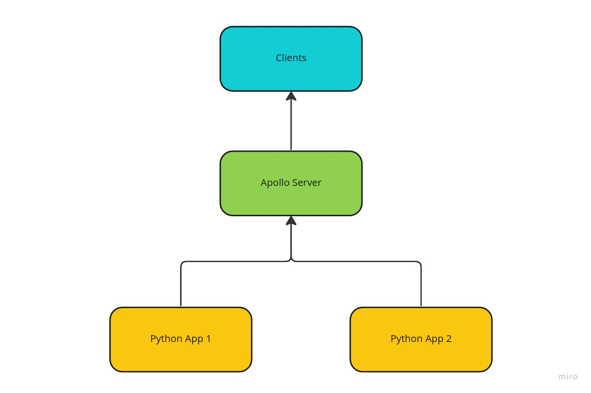
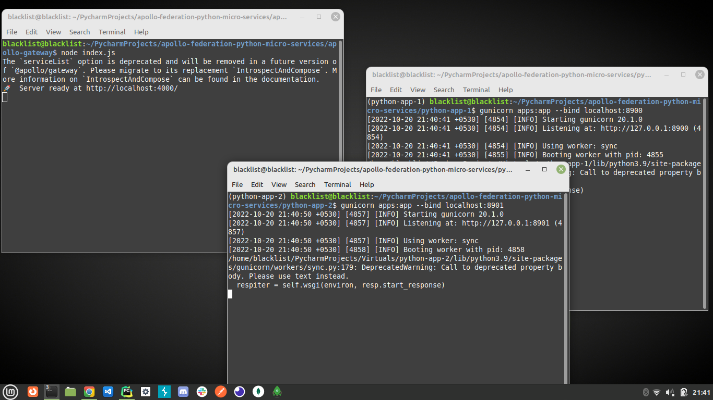

# Apollo Federation with Python Micro services

Demonstration of federated GraphQL microservices using Python and Apollo federation.

### Example Services

- [Apollo Gateway](apollo-gateway)
- [Python App 1](python-app-1)
- [Python App 2](python-app-2)



Federated GraphQL APIs


### Install Demo

1. Clone repository
    ```shell
    git clone https://github.com/thameemk612/apollo-federation-python-micro-services.git
    cd apollo-federation-python-micro-services
    ```
2. Run Python App 1
    ```shell
   cd python-app-1
   python3 -m pip install virtualenv
   python3 -m virtualenv venv
   source venv/bin/activate
   pip3 install pipenv
   pipenv install
   gunicorn apps:app --bind localhost:8900 -t=600
   ```
3. Run Python App 2
    ```shell
   cd python-app-2
   python3 -m virtualenv venv
   source venv/bin/activate
   pip3 install pipenv
   pipenv install
   gunicorn apps:app --bind localhost:8901 -t=600
   ```
4. Run Apollo Gateway
    ```shell
   cd apollo-gateway
   npm install
   node index.js
   ```
   

### References

- [GraphQL](https://graphql.org/)
- [Python GraphQL](https://graphql.org/code/#python)
- [Apollo GraphQL](https://www.apollographql.com/docs/apollo-server/)

