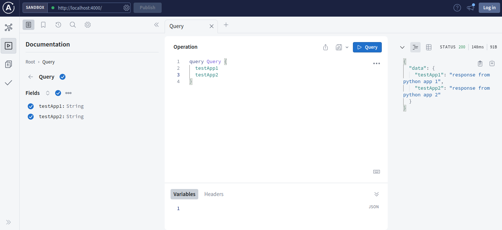

# Apollo Federation with Python Micro services

Demonstration of federated GraphQL microservices using Python and Apollo federation.

### Example Services
- [Apollo Gateway](apollo-gateway)
- [Python App 1](python-app-1)
- [Python App 2](python-app-2)

Federated GraphQL APIs

### References
- [GraphQL](https://graphql.org/)
- [Python GraphQL](https://graphql.org/code/#python)
- [Apollo GraphQL](https://www.apollographql.com/docs/apollo-server/)

